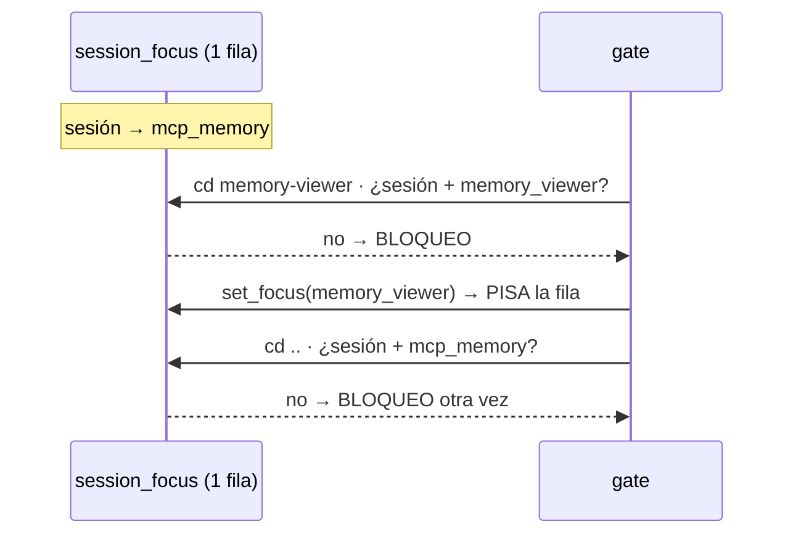

# set_focus: por qué el gate lo pide al cambiar de ruta

Thread relacionado: `a3f276f2`.

## Qué decide el gate

El gate no mira la ruta del archivo editado. Usa la **carpeta de trabajo de la sesión**, y solo cuenta si coincide **exacto** con `project_paths`.

```text
Prompt del usuario
  claude-user-prompt.cjs
    resolveCwd(cwd)                     ← WHERE path_key = ?  (match exacto)
      sin match → no escribe nada
      match     → setProvisionalFocus(sesión, proyecto, prompt)
        fila declarada (provisional=0)  → no la toca
        prompt es ack ("ok", "sigue")   → no la toca si ya hay fila

Edit / Write / Bash que muta
  mutation-gate.evaluate
    resolveCwd(cwd)
      sin match → pasa (fail-open)
    checkFocusForSession: ¿fila con ESTA sesión Y ESTE proyecto?
      no → BLOQUEO "llamá set_focus"
```

La tabla y el gate no coinciden:

- `session_focus` guarda **una fila por sesión**: `ON CONFLICT(session_id)`.
- El gate busca **sesión + proyecto**: `WHERE project_id = ? AND session_id = ?`.

## Paths registrados que lo disparan

```text
/home/joel/.config/mcp-learning                  → mcp_memory
/home/joel/.config/mcp-learning/memory-viewer    → memory_viewer   ← proyecto distinto, anidado
/home/joel/.config/agent-rules                   → agent_rules
```

## Cuándo cobra un turno

### 1. Cambio de proyecto dentro de la sesión



### 2. Un focus declarado congela los provisionales

Después de un `set_focus` explícito la fila queda con `provisional = 0`. El upsert provisional exige `WHERE session_focus.provisional = 1`, así que ningún prompt posterior mueve la fila a otro proyecto. Cada cambio de proyecto pide `set_focus` a mano.

### 3. Primer prompt en el proyecto nuevo es un ack

Con una fila existente de otro proyecto, un "ok" / "sigue" hace `ON CONFLICT(session_id) DO NOTHING`. El gate bloquea.

### Caso inverso: subcarpeta no registrada

Desde `rust/src/bin` no hay match: el gate no bloquea y el focus tampoco se actualiza. La sesión `5db2a6bd` conservó el prompt del 2026-09-16 durante todo el trabajo posterior en esa subcarpeta.

## Opciones

| | **A. Gate por sesión** | **B. Fila por (sesión, proyecto)** |
|---|---|---|
| Regla | Pasa si la sesión tiene algún focus | Cada proyecto de la sesión tiene su fila |
| Cambio | Query en `focus-gate.cjs` | Migración + `set_focus` en Rust + `ON CONFLICT(session_id, project_id)` en JS |
| Build | No | Sí |
| Pérdida | Sesión multi-proyecto traza el focus en uno solo | Ninguna |
| Caso 2 | Resuelto | Resuelto |

Recomendada: **B**. **A** sirve como parche inmediato.
