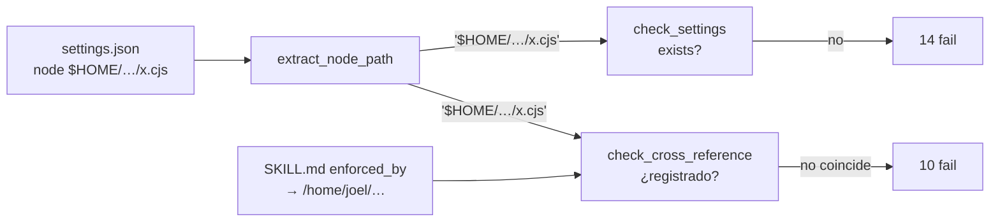

# verify-rules: 24 fails falsos por `$HOME` sin expandir

## Síntoma

Tras cada edición en `agent-rules/`, `verify-on-edit.cjs` reporta `24 fail, 0 warn`:

- 14 × `[settings:claude] hook registrado no existe: $HOME/...`
- 10 × `[cross-reference] <skill>: enforced_by '...' (Claude) no está registrado en settings.json`

Los 14 hooks existen y corren. Ningún fail es real.

## Causa

`settings.json` registra los hooks como `node $HOME/.config/...`. `$HOME` lo expande `bash` al ejecutar el hook; `verify-rules` lee el JSON y lo toma literal.

```text
verify_rules
  load_claude_hooks(settings.json)
    extract_node_path("node $HOME/.config/.../claude-pre-tool.cjs")
      → PathBuf("$HOME/.config/.../claude-pre-tool.cjs")   ← "$HOME" literal
  check_settings
    p.exists()                              → false   ×14
  check_cross_reference
    claude_set ∋ normalize(enforced_by)?    → no      ×10
```



`extract_node_path` se escribió para paths absolutos de Windows (`node C:/.../foo.cjs`). El commit `7623344` (rutas portables) pasó `settings.json` a `$HOME/...` y el verificador quedó atrás.

## Arreglo

Expandir `$HOME` / `~` en la extracción. Un solo punto; los dos chequeos se corrigen solos.

`rust/src/bin/verify_rules.rs:398`

```diff
-/// `node C:/.../foo.cjs` → `C:/.../foo.cjs`. Ignora hooks que no son node.
+/// `node $HOME/.../foo.cjs` → `/home/<user>/.../foo.cjs`. Ignora hooks que no son node.
 fn extract_node_path(cmd: &str) -> Option<PathBuf> {
     let t = cmd.trim();
     let rest = t.strip_prefix("node ")?.trim();
     let p = rest.split_whitespace().next()?;
-    Some(PathBuf::from(p))
+    Some(expand_home(p))
 }
+
+fn expand_home(p: &str) -> PathBuf {
+    let Some(home) = std::env::var_os("HOME").or_else(|| std::env::var_os("USERPROFILE")) else {
+        return PathBuf::from(p);
+    };
+    match p.strip_prefix("$HOME").or_else(|| p.strip_prefix("~")) {
+        Some(rest) => PathBuf::from(home).join(rest.trim_start_matches(['/', '\\'])),
+        None => PathBuf::from(p),
+    }
+}
```

`USERPROFILE` cubre Windows, donde el verificador también corre.

## Resultado esperado

```text
ok  [settings:claude]  14 hooks registrados, todos existen
ok  [cross-reference]  todas las referencias coinciden
```

Cualquier fail que quede después es real.
